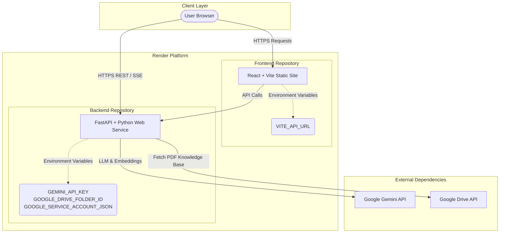
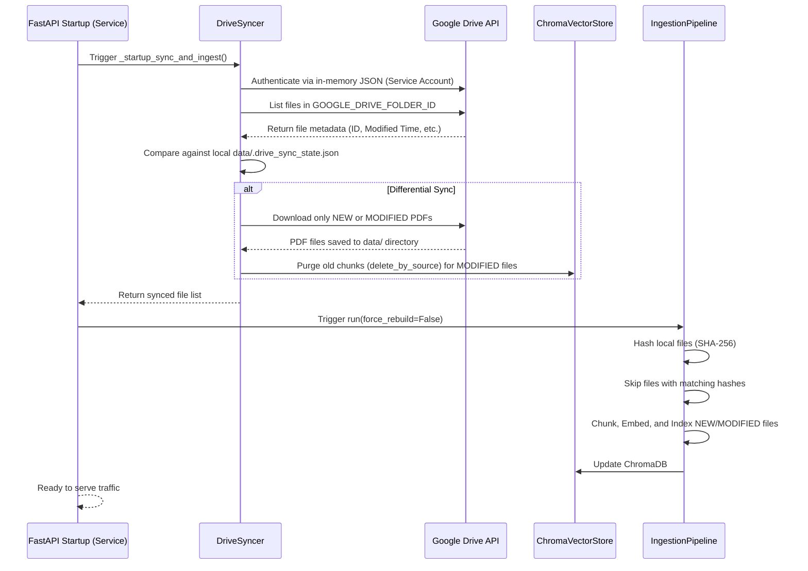
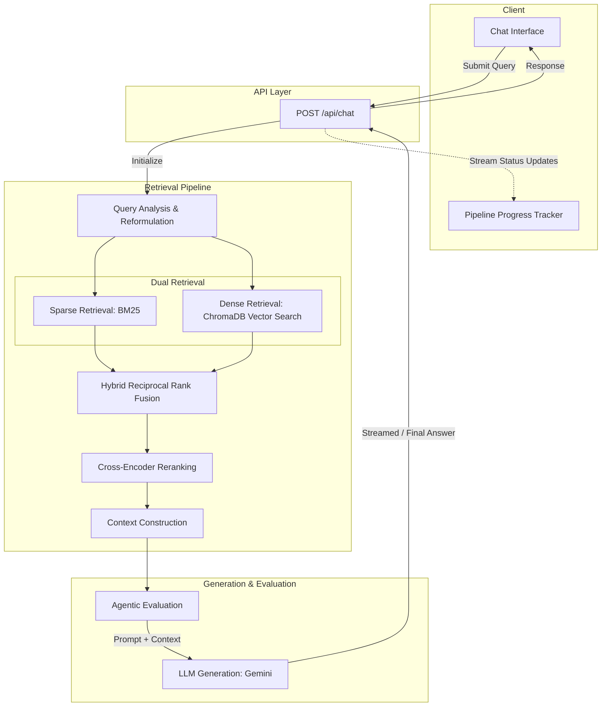
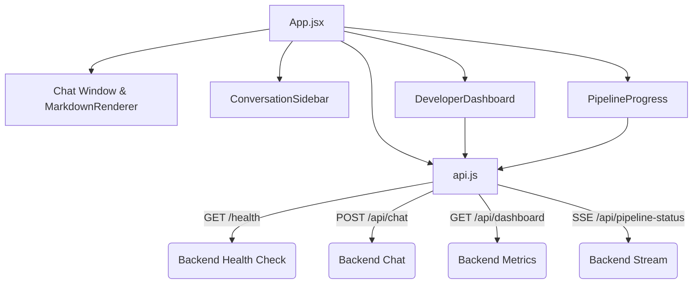

# System Architecture & Flow — Agentic Placement RAG

This document outlines the complete system architecture, deployment strategy, data ingestion flow, and query execution pipeline of the Placement RAG Agent. 

---

## 1. High-Level Deployment Architecture

The system is deployed on **Render** using a decoupled Frontend-Backend architecture.

---

## 2. Startup Data Ingestion Flow

When the backend starts up, it automatically synchronizes its knowledge base with Google Drive without manual intervention.

---

## 3. Query Execution Pipeline (RAG Flow)

When a user submits a message, the request routes through a sophisticated, multi-stage retrieval and generation pipeline. The frontend tracks this progress in real-time via Server-Sent Events (SSE).

---

## 4. Frontend Application Structure

The frontend acts as a pure presentation layer. It manages application state, renders markdown, and routes all logic to the backend API service layer.

> [!NOTE]
> **Security Posture**: The frontend has exactly zero dependencies on Gemini or Google Cloud credentials. It operates as a thin client relying exclusively on `VITE_API_URL` to securely route traffic to the backend, ensuring zero API keys are ever exposed in the browser.
