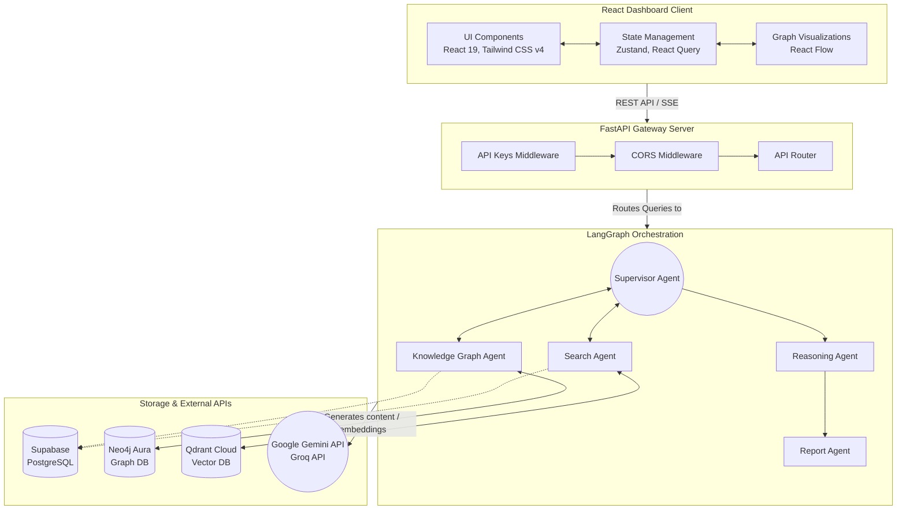
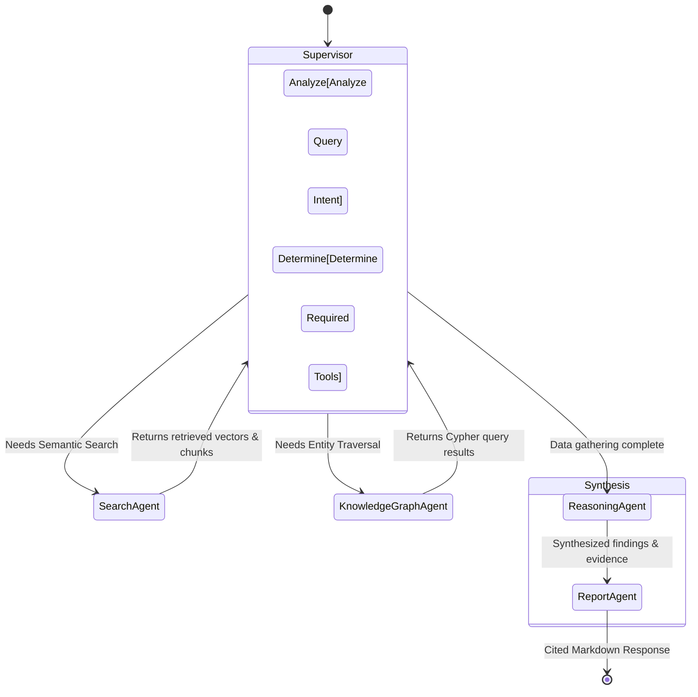
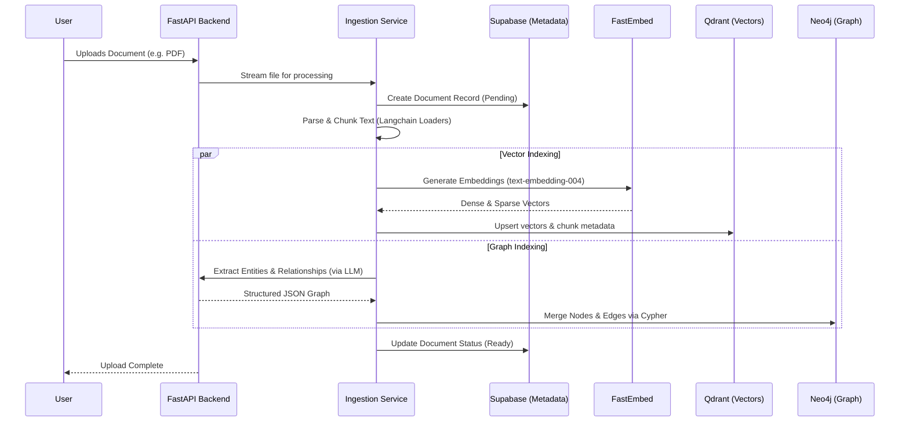
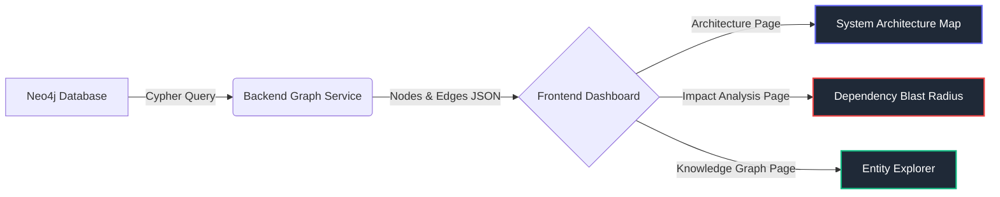

# 🏗️ EKIP System Architecture & Flow

This document provides a comprehensive architectural breakdown of the **Enterprise Knowledge Intelligence Platform (EKIP)**. It outlines the core system topology, the LangGraph multi-agent orchestration flow, and the multi-database data pipelines.

## 1. System Architecture (High Level)

EKIP follows a modern decoupled architecture, combining a React SPA frontend with a high-performance Python asynchronous backend. The backend bridges LLMs with a heterogeneous database layer designed for specialized storage and retrieval.

> [!TIP]
> **Why three databases?**
> - **Supabase** handles tabular metadata, authentication, and structured document records.
> - **Qdrant** provides extremely fast Hybrid Semantic Search (dense embeddings + sparse keyword search with RRF).
> - **Neo4j** allows for complex traversal logic (e.g., finding the impact radius if a specific microservice goes down).

---

## 2. Multi-Agent Orchestration Flow (LangGraph)

The core logic of EKIP is powered by a cyclic, stateful graph using **LangGraph**. A Supervisor agent dynamically routes execution, allowing specialized agents to conduct multiple hops of retrieval before synthesizing an answer.

### Agent Roles

- **Supervisor Agent**: The brain of the operation. It assesses the user query against the current `EKIPState` and decides whether to invoke the Search Agent, the KG Agent, or if enough context has been gathered to proceed to Reasoning.
- **Search Agent**: Interfaces directly with Qdrant to perform hybrid vector search over embedded document chunks.
- **Knowledge Graph Agent**: Translates natural language into Cypher queries, executing them against Neo4j to extract relationship paths and dependency structures.
- **Reasoning Agent**: Synthesizes the raw data gathered from the Search and KG agents. It validates evidence, removes hallucinations, and draws conclusions.
- **Report Agent**: Takes the Reasoning Agent's conclusions and formats them into a beautifully structured, highly readable markdown report with inline citations linking back to source documents.

---

## 3. Data Ingestion Pipeline

When a new document (PDF, DOCX, Markdown, etc.) is uploaded via the **DocumentsPage**, it triggers a multi-modal ingestion pipeline.

> [!IMPORTANT]
> The dual-indexing strategy ensures that every piece of knowledge is retrievable via both **semantic meaning** (Qdrant) and **explicit structural relationships** (Neo4j).

---

## 4. Interactive Knowledge Explorer (React Flow)

The frontend features advanced data visualization capabilities using React Flow. This allows users to visually interact with the data returned by the backend.

Through these interfaces, users can click on a node (e.g., an API Gateway) and dynamically load connected dependencies or view related semantic documents retrieved seamlessly from Qdrant.
