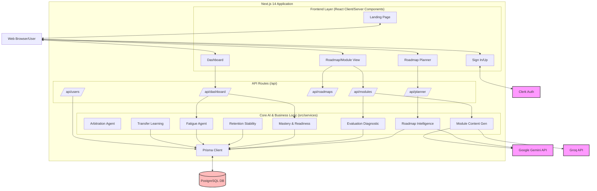
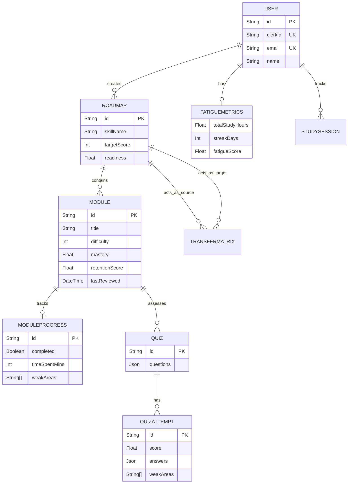

# NeuroPlan AI: Architecture & Flow

This document outlines the architecture, data flow, and key components of the **NeuroPlan AI** project. The project is built using the **Next.js 14 App Router**, integrating with **Clerk** for authentication, **Google Gemini/Groq** for AI capabilities, and **PostgreSQL** via **Prisma ORM** for data persistence.

---

## 1. High-Level Architecture

The system follows a modern full-stack serverless architecture using Next.js. 

---

## 2. Core Components & Logic

The intelligence of NeuroPlan AI lives in the `src/services/` directory. The application isn't just a basic CRUD wrapper; it acts as an intelligent tutor system with multiple specialized agents:

- **Roadmap Intelligence (`roadmap-intelligence.ts`)**: Responsible for taking user goals and prompting the AI (Gemini) to generate structured learning paths (Roadmaps + Modules).
- **Module Content (`module-content.ts`)**: Dynamically generates or retrieves the actual learning material for each module within a roadmap.
- **Evaluation Diagnostic (`evaluation-diagnostic.ts`)**: Evaluates user quiz attempts and identifies weak areas based on the generated rubrics.
- **Mastery & Readiness (`mastery-readiness.ts`)**: Calculates a user's mastery score for specific modules based on their quiz performance and updates the overall readiness for the roadmap.
- **Retention Stability (`retention-stability.ts`)**: Implements Spaced Repetition Logic (e.g., Ebbinghaus forgetting curve). Determines when a user needs to review a module.
- **Fatigue Agent (`fatigue-agent.ts`)**: Monitors `StudySession` metrics to calculate cognitive load/fatigue. Can suggest breaks or adjust difficulty dynamically.
- **Transfer Learning (`transfer-learning.ts`)**: Analyzes how skills learned in one roadmap (e.g., Python) map to another roadmap (e.g., JavaScript) via the `TransferMatrix` database model.
- **Arbitration Agent (`arbitration-agent.ts`)**: Likely acts as the orchestrator that balances user requests, fatigue levels, and retention needs to decide what the user should study next.

---

## 3. Database Schema Overview (Prisma)

The application uses PostgreSQL with Prisma ORM. Below is an ER diagram representing the core data entities.

---

## 4. Primary User Flows

### A. The Generation Flow (Creating a Roadmap)
1. User authenticates via **Clerk**.
2. User submits a learning goal on the `/planner` UI.
3. The frontend makes a POST request to `/api/planner`.
4. `roadmap-intelligence.ts` intercepts this and communicates with **Google Gemini / Groq**.
5. The AI returns a JSON-structured curriculum.
6. The backend persists the `Roadmap` and `Module` records via **Prisma**.
7. The user is redirected to `/roadmaps/[id]` to view their customized curriculum.

### B. The Learning & Assessment Flow
1. User clicks on a `Module` to start studying. A `StudySession` is initialized.
2. The UI fetches content generated dynamically via `/api/modules/`.
3. User completes the content and takes a `Quiz`.
4. Quiz answers are submitted to the API. `evaluation-diagnostic.ts` grades the quiz.
5. A `QuizAttempt` is logged to the DB.
6. `mastery-readiness.ts` calculates the new `mastery` score for the module.
7. `retention-stability.ts` calculates the `decayFactor` to schedule the next review.
8. The `StudySession` is closed, updating `FatigueMetrics`.
